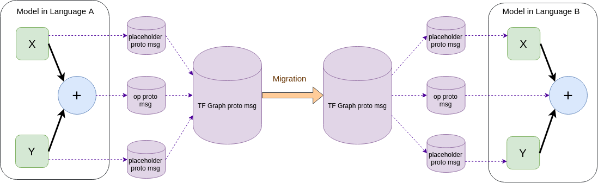
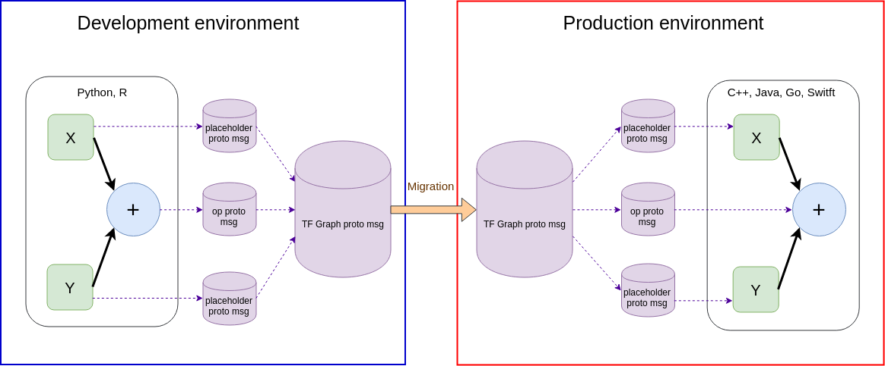

# Model portability

The following is an high-level example of the portability mechanism of TensorFlow:

The main idea of a common workflow is simple ;

  1. Do model prototyping in a high-level
language suitable for analysts, modelers, mathematicians (e.g. `Python`, `R`) 

  2. Export the model in a form of protobuf messages and migrate them to a production code (e.g. `C++`, `Java`, `Go`, `Swift`) that will deploy the model.

