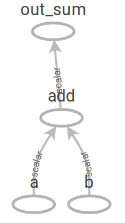
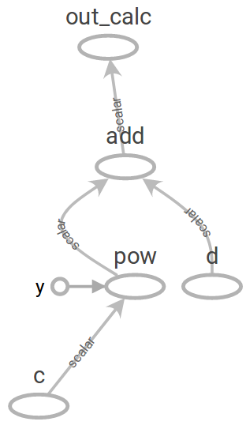
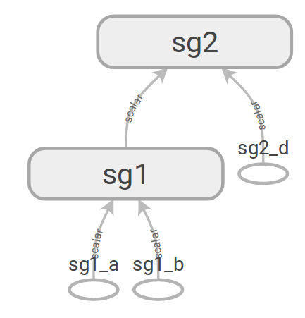
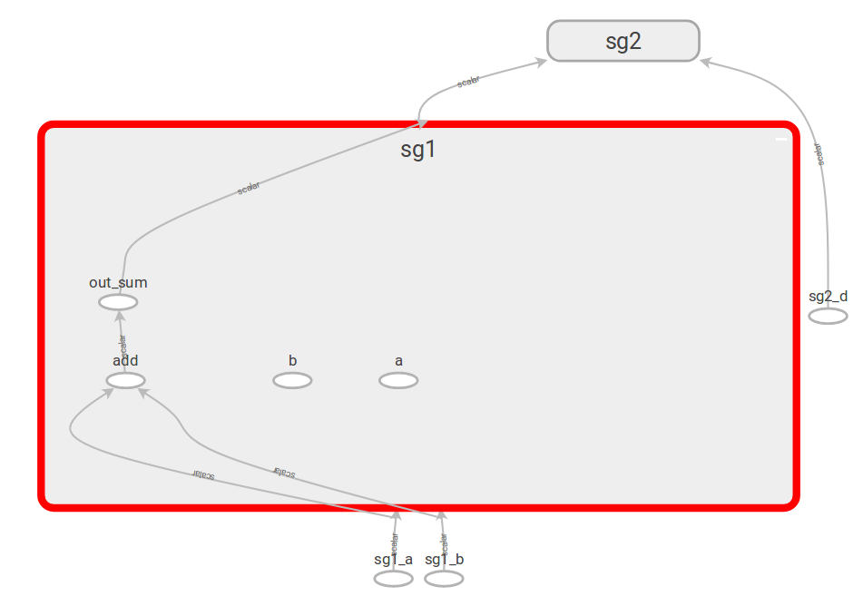
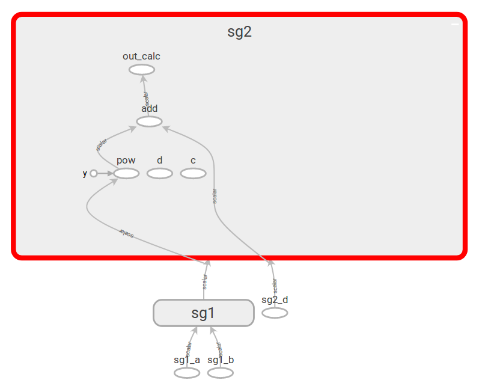
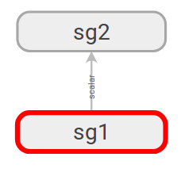
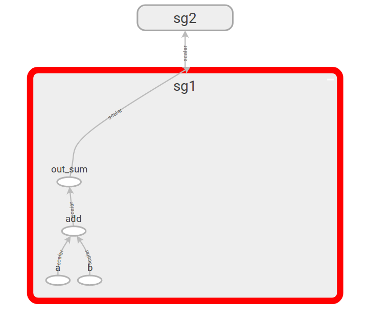
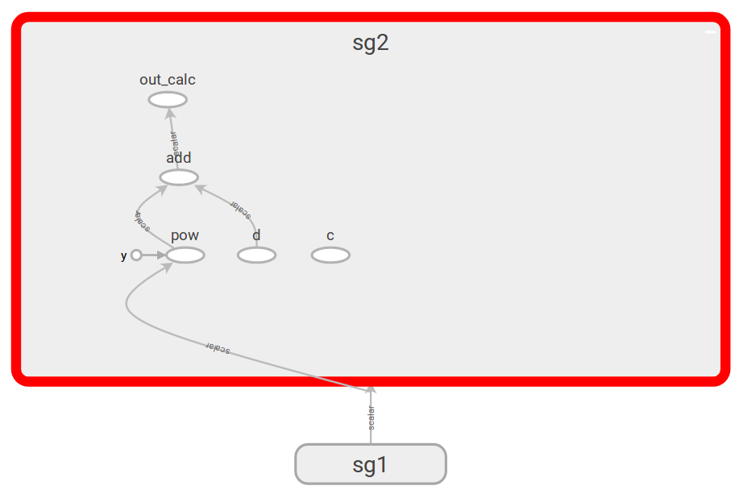

# Graph composition

TensorFlow models can be composed of several submodels. The design of larger models is usually split into the design of several sub-models, each governed more-or-less independently by a separate team of experts.

TensorFlows does the assembly of a model from several submodels in a straightforward manner using the `tf.import_graph_def` function and the `GraphDef` protos. This has the benefit of having a modular design of a model, where any submodel with a given purpose can be easy replaced by another submodel with the same purpose (e.g. submodels doing pre-processing, core computations, post-processing).

The following simple example illustrates the process of submodel composition. 

## Simple task

The taks is to do the following simple computation:
```
w = (x + y)^2 + z
```
For demonstration purposes, we will split the computational task into two:

  1. Task 1 - this will be the purpose of the first submodel, which will have its graph denoted as **Sub-graph 1**. The task will be to calculate:
  ```
  x + y
  ```
  The inputs for Sub-graph 1 are denoted by `a` (represents x) and `b` (represents y).
  
  2. Task 2 - this will be the purpose of the second submodel, which will have its graph denoted as **Sub-graph 2**. The task will be to calculate:
  ```
  u^2 + t
  ```
  The inputs for Sub-graph 1 will be denoted `c` (represents u) and `d` (represents t).

We will then combine Sub-graph 1 and 2 into a resulting graph. We will do so in two slightly different ways (both giving the same functionality).

This example contains three `Python` scripts:

  * `subgraph1.py` - script for creating Sub-graph 1.
  * `subgraph2.py` - script for creating Sub-graph 2.
  * `graph_composer.py` - script for composing Sub-graphs 1 and 2 into a one graph.

To run all the scripts, run the `run_all.sh` script:
```
./run_all.sh
```

This will execute all the three `Python` scripts and will generate the following folders:
  
  * `graph_def_files` - contains the `GraphDef` protos for the model graph of each script. The protos are both in binary and human-readable formats.
  * `summary_files` - contains summary protos for each model graph. The user can analyze them from TensorBoard.

## Sub-graph 1

The following is the graph of Sub-graph 1 in TensorBoard.



## Sub-graph 2

The following is the graph of Sub-graph 2 in TensorBoard.



## Combining sub-graphs : approach 1

The first approach is to use the `input_map` input argument in the `tf.import_graph_def` function for defining the binding relation between the current graph and the inported two sub-graphs. In our case, it would be done by the following manner:

  1. For importing Sub-graph 1, we create the new placeholders `sg1_a` and `sg1_b` for connecting to the placeholders `a` and `b` in Sub-graph 1. We then set the `input_map`: 
  ```python
  input_map={
      "a:0": sg1_a,
      "b:0": sg1_b,
  }
  ```
  We set the `return_elements` to return the `out_sum` op node from Sub-graph 1 :
  ```python
  return_elements=["out_sum:0"]
  ```
  The `tf.import_graph_def` then returns a one-element list of tensors, which contains the `out_sum` op node, which value we now can compute in a standard way using the `Session.run` function and the `feed_dict` map containing values for `sg1_a` and `sg1_b`. We label this op node as `sg1_out_sum`.
  
  2. For importing Sub-graph 2, we create the new placeholders `sg2_d` and connect it and the output node `sg1_out_sum` with the inputs of Sub-graph 2 again, via the input argument `input_map`:
  ```python
  input_map={
      "c:0":sg1_out_sum,
      "d:0":sg2_d,
  },
  ```
  We set the `return_elements` to return the `out_calc` op node from Sub-graph 2 :
  ```python
  return_elements=["out_calc:0"]
  ```
  The `tf.import_graph_def` then returns a one-element list of tensors, which contains the `out_calc` op node and we label this op node as `sg2_out_calc`.
  
Thus we have imported and connected the two subgraphs. The following is the complete code block of the graph import and connection:

```python
sg1_a = tf.placeholder(shape=[], dtype=tf.float64, name="sg1_a")
sg1_b = tf.placeholder(shape=[], dtype=tf.float64, name="sg1_b")
sg2_d = tf.placeholder(shape=[], dtype=tf.float64, name="sg2_d")

# Read the first sub-graph's GraphDef proto.
with open("graph_def_files/subgraph1_graph_def.pb", "rb") as graph1_file:    
    graph1_graph_def = tf.GraphDef()
    graph1_graph_def.ParseFromString(graph1_file.read())
  
# Get the output from the first sub-graph
sg1_out_sum, = tf.import_graph_def(
        graph_def=graph1_graph_def,
        name="sg1",
        input_map={
            "a:0": sg1_a,
            "b:0": sg1_b,
        },
        return_elements=["out_sum:0"],
)

# Read the second sub-graph's GraphDef proto.
with open("graph_def_files/subgraph2_graph_def.pb", "rb") as graph2_file:    
    graph2_graph_def = tf.GraphDef()
    graph2_graph_def.ParseFromString(graph2_file.read())
  
# Get the output from the second sub-graph
sg2_out_calc, = tf.import_graph_def(
        graph_def=graph2_graph_def,
        input_map={
            "c:0":sg1_out_sum,
            "d:0":sg2_d,
        },
        name="sg2",
        return_elements=["out_calc:0"],
)
```

The following is the TensorBoard-generated graph of our composed graph:



We can see that Sub-graphs 1 and 2 are encapsulated each in ther name scopes. This is for better graph readability and graph model debugging.

Expanding the name scope of Sub-graph 1, we can see the following:



Expanding the name scope of Sub-graph 2, we can see the following:



In both previous graphs we can see that the original placeholders for each sub-graph is disconnected from the op nodes and left unconnected. This is due to the fact that we have used the `input_map` for specifying the input nodes for each sub-graph.

The unconnected placeholders will remain unused and the TensorFlow framework will not allocate any memory resource for them. This is due the fact that TensorFlow uses the **lazy evaluation** approach when doing graph computations.

## Combining sub-graphs : approach 2

The second approach is to not to use the `input_map` input argument in the `tf.import_graph_def` for the Sub-graph 1 and, instead, to return all the corresponding placeholder op nodes from each sub-graph. Similarly, we will use `input_map` only for mapping `sg1_out_sum` to the placeholder `c` for the Sub-graph 2:

  1. For importing Sub-graph 1, we set the `return_elements` to return the addition `out_sum` op node and the `a`, `b` placeholder op nodes from Sub-graph 1 :
  ```python
  return_elements=["out_sum:0", "a:0", "b:0"]
  ```
  We then receive the three tensors `sg1_out_sum`, `sg1_a`, `sg1_b` from `tf.import_graph_def`:
  ```python
  sg1_out_sum, sg1_a, sg1_b = tf.import_graph_def(
          graph_def=graph1_graph_def,
          name="sg1",
          return_elements=["out_sum:0", "a:0", "b:0"],
  )
  ```
  2. For importing Sub-graph 2, we connect the output node `sg1_out_sum` with the input placeholder op node `c` of Sub-graph 2 again, via the input argument `input_map`:
  ```python
  input_map={
      "c:0":sg1_out_sum,
  },
  ```
  We set the `return_elements` to return the `out_calc` op node and `d` placeholder op node from Sub-graph 2 :
  ```python
  return_elements=["out_calc:0", "d:0"]
  ```
  We then receive the three tensors `sg2_out_calc`, `sg2_d` from `tf.import_graph_def`:
  ```python
  sg2_out_calc, sg2_d = tf.import_graph_def(
          graph_def=graph2_graph_def,
          name="sg2",
          return_elements=["out_calc:0", "d:0"],
  )
  ```
Thus we have imported and connected the two subgraphs. The following is the complete code block of the graph import and connection:

```python
# Read the first sub-graph's GraphDef proto.
with open("graph_def_files/subgraph1_graph_def.pb", "rb") as graph1_file:    
    graph1_graph_def = tf.GraphDef()
    graph1_graph_def.ParseFromString(graph1_file.read())
  
# Get the output from the first sub-graph
sg1_out_sum, sg1_a, sg1_b = tf.import_graph_def(
        graph_def=graph1_graph_def,
        name="sg1",
        return_elements=["out_sum:0", "a:0", "b:0"],
)

# Read the second sub-graph's GraphDef proto.
with open("graph_def_files/subgraph2_graph_def.pb", "rb") as graph2_file:    
    graph2_graph_def = tf.GraphDef()
    graph2_graph_def.ParseFromString(graph2_file.read())
  
# Get the output from the second sub-graph
sg2_out_calc, sg2_d = tf.import_graph_def(
        graph_def=graph2_graph_def,
        name="sg2",
        input_map={
          "c:0":sg1_out_sum,
        },
        return_elements=["out_calc:0", "d:0"],
)
```

The following is the TensorBoard-generated graph of our composed graph:



Expanding the name scope of Sub-graph 1, we can see the following:



Expanding the name scope of Sub-graph 2, we can see the following:



Compared to the first approach, we see that in the name scope of Sub-graph 1, both the placeholders `a` and `b` are used in the current graph as inputs. In the name scope of Sub-graph 2 we still see that the placeholder op node `c` is still unused, but this is due to the necessary mapping of `sg1_out_sum`.

## Comparison of both approaches

Functionally, both approaches are equivalents. The only difference is the overall graph's organization. For a better graph and prototype code readability, **approach 1 is preferred**, due to the fact that we explicitly outline the input mapping between graphs via the `input_map` argument.
